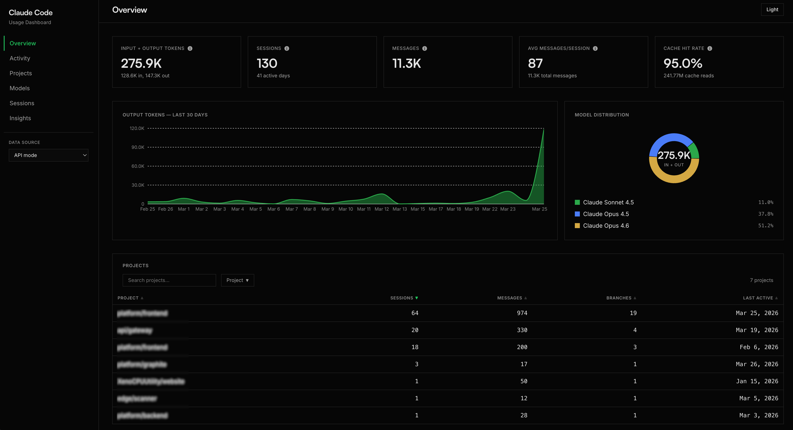

# Claude Code Usage Dashboard

A local dashboard for visualizing your Claude Code CLI usage. Reads local `~/.claude/` files by default. Optionally connect the Anthropic Admin API for org-wide usage across all devices — switchable at runtime from the sidebar.



## Prerequisites

- **Docker** (and Docker Compose)
- **Claude Code CLI** — you must have used it at least once so `~/.claude/` contains usage data

## Quick Start

```bash
# 1. Copy the example env file
cp .env.example .env

# 2. (Optional) Add your Anthropic Admin API key to .env

# 3. Build and run
docker compose up --build
```

Open [http://localhost:3080](http://localhost:3080) in your browser.

## Configuration

### Local Only (default)

Works out of the box — just copy `.env.example` to `.env` and run. Reads usage data from `~/.claude/` on this machine (mounted **read-only** inside the container).

```bash
# .env
CLAUDE_DATA_DIR=~/.claude
PORT=3080
```

## Pages

- **Overview** — KPI summary: input/output tokens, sessions, messages, avg messages/session, cache hit rate. Top projects table and model distribution donut chart.
- **Activity** — Daily output tokens by model (stacked area chart), sessions and messages over time. Sortable daily breakdown table. Filterable by date range.
- **Projects** — Sessions per project bar chart, searchable/sortable/filterable project table with branches, message counts, and date ranges.
- **Models** — Token distribution donut chart, detailed breakdown table per model with input/output/cache tokens.
- **Sessions** — Searchable, sortable, filterable session list with multi-select filters for Project and Branch columns.
- **Insights** — Cache hit rate, average messages per session, peak usage hour, session-start-by-hour bar chart, and longest session stats.

## Development

Run the server and client separately for hot-reload:

```bash
# Terminal 1: Server
cd server
npm install
CLAUDE_DATA_DIR=~/.claude npm run dev

# Terminal 2: Client
cd client
npm install
npm run dev
```

Client runs on http://localhost:5173 and proxies API requests to the server on port 3080.

## Tech Stack

- **Frontend**: React 19, Vite, TypeScript, Tailwind CSS v4, Recharts, TanStack Query
- **Backend**: Hono (Node.js), TypeScript
- **Container**: Docker with multi-stage build, `node:22-alpine`

## Data Sources

**Local files** (always read):

| File | Content |
|------|---------|
| `stats-cache.json` | Aggregated daily activity, model tokens, session counts, hour distribution |
| `projects/*/sessions-index.json` | Per-project session metadata (branch, timestamps, message counts) |
| `projects/*/*.jsonl` | Full conversation logs (parsed on-demand for session detail) |
